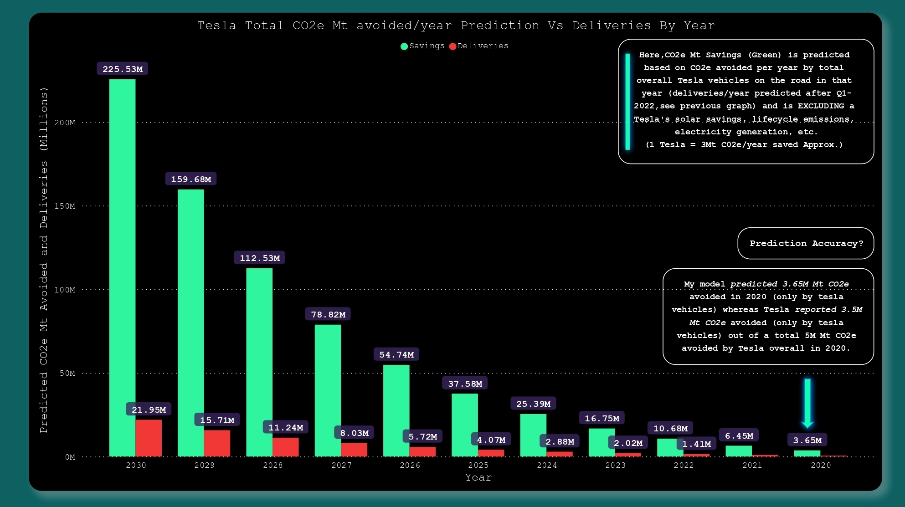
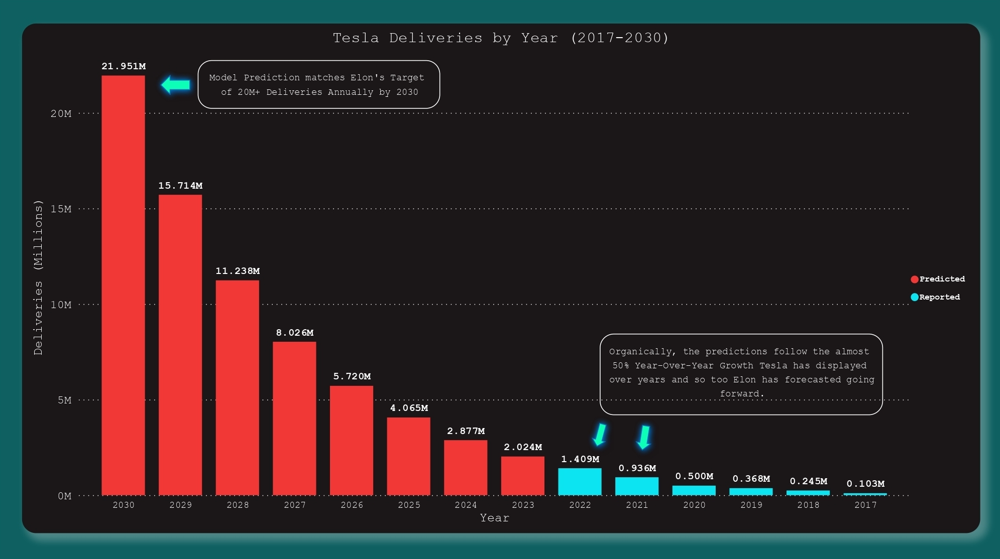
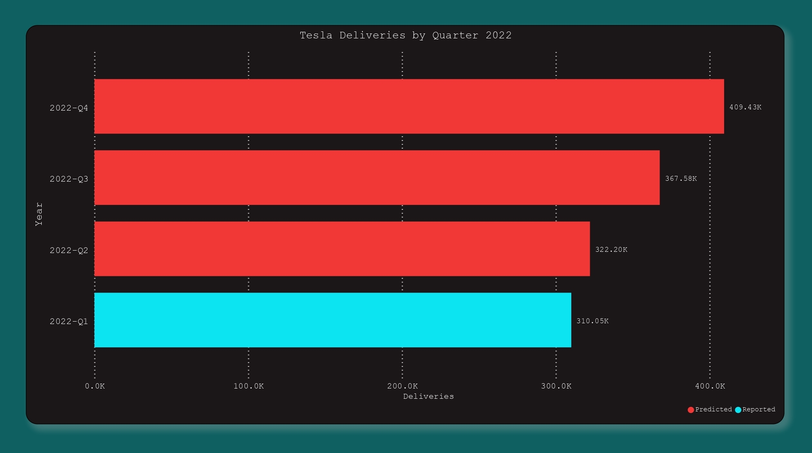

# Tesla CO2 Savings Prediction

## Description
Building a ML model to Predict Tesla's deliveries then calculating it's CO2 Savings by 2030 based on publicly available data.

## Objectives

* Predict Tesla Deliveries by 2030
* Calculate CO2 Savings of all Teslas(sum of all delvieries till date) on road in that year
* NOTE these predictions were excluding lifecycle emissions, electricity generation,solar,ect.
* 1 Tesla = 3Mt C02 Saved/year

## Report
* Report is on my Twitter
* Link: https://twitter.com/tanaydesaii/status/1517654830356987904?s=20&t=wFbil4-DqluwfyDPcUc3Ig
### Tesla Savings and Deliveries till 2030

### Tesla Deliveries till 2030

### Tesla Deliveries till 2023

## Metrics for Delivery Prediction

* Model will predict the deliveries of a quater based on the deliveries of the past 3 quaters
* This was also the format of the Training and Testing x dataset
* x = 3 quaters deliveries
* y = 4th quater deliveries

##  Data Used 

* Tesla Quaterly Deliverires from Q2 2016 till Q1 2022

## Dependencies

* Pandas
* Sklearn
* Numpy and math
* Matplotlib

## Models Used
Only the Highest Accuracy Model was used.

* LinearRegression (mse=0.0028)
* DecisionTreeRegressor (mse=0.1792)
* XGBRegressor (mse=0.1852)
* SVR (mse=0.4608)

## Accuracy
* All Predictions match 50% YoY growth of Tesla
* Tesla vehicles alone saved 3.5M Mt in 2020
* Our Model Predicted 3.65M Mt in 2020

## Authors

Tanay Desai 
Twitter: [@tanaydesaii](https://twitter.com/tanaydesaii)

## License

This project is licensed under the [NAME HERE] License - see the LICENSE.md file for details
